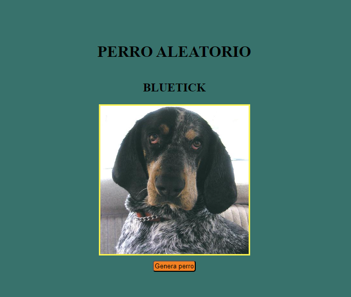

# Prueba técnica para juniors
Endpoint para obtener datos de una raza aleatoria de perros

La siguiente es una prueba técnica para juniors y trainees de React en Live, basada en una adaptación de la clase de YouTube Midulive (https://www.youtube.com/watch?v=XYpadB4VadY).

La tarea consiste en extraer datos de un endpoint de perros, seleccionar aleatoriamente una raza de un objeto que contiene un listado de razas y, a continuación, obtener una imagen de la raza seleccionada llamando a otro endpoint.

Se ha creado un botón para permitir al usuario generar una nueva raza aleatoria cada vez que lo necesite.

## Versión NODE

18.0.0

El proyecto se creo con vitejs / javascript vanilla y se adapto a react

## Endpoints
### Sitios para obtener los endpoints
https://dog.ceo/dog-api/documentation/

| endpoint 1  |  endpoint 2 |
| ------------ | ------------ |
|  https://dog.ceo/api/breeds/list/all |https://dog.ceo/api/breed/Affenpinscher/images/random  |
|   |   |

